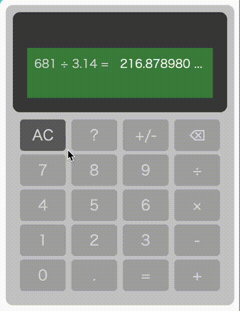

# CSS-Only Calculator — No JavaScript, Pure CSS Logic

A fully functional calculator built with **0% JavaScript**.  
All logic is implemented using CSS variables, container queries, and state transitions.  
This project started as a small experiment and gradually evolved into something… cursed, but fun.

## Live Demo
- Latest version: [CodePen link](https://codepen.io/cascade-path/full/WbGzwdG)
- First prototype (v1): [CodePen link](https://codepen.io/cascade-path/full/myrxBEo)

## How It Works
This calculator performs arithmetic operations using only CSS:

- Numbers are stored in CSS variables (`--ax`, `--ay`, etc.)
- The result is computed using `calc()` inside width calculations
- Container queries “read” the width and convert it into text output
- UI state is controlled by `:has()` selectors and radio inputs

## Features
- Pure CSS logic (no JS at all)
- Supports +, -, ×, ÷
- Dynamic UI using `:has()`
- Result decoding via container queries
- Multiple versions available (prototype → latest)

## Why I Made This
I wanted to explore how far CSS can be pushed beyond its intended purpose.  
This project is not practical — it’s a demonstration of what CSS can do when abused creatively.

## Browser Support
- Chrome ✔
- Firefox ✔
- Safari / iOS ❌ (some features like `attr()` and container queries behave differently)

## Versions

### v1 — First Prototype
- Uses container width as the “numeric value”
- Result is decoded entirely through `@container` rules
- Simple, cursed, and surprisingly stable

### v2 — Current Version
- Improved UI
- More readable output
- More expressive CSS logic

## Screenshots

## License
MIT License
